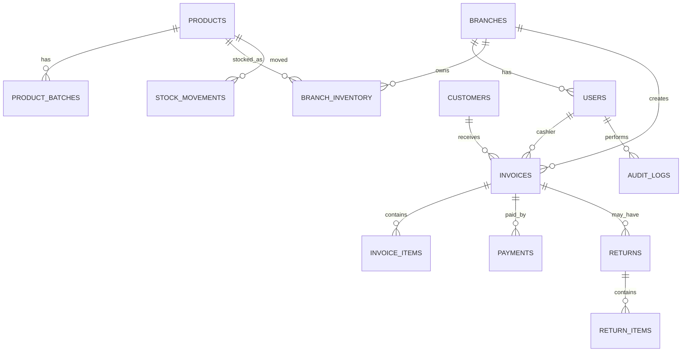

# Pharmacy Payment Application - Business And Technical Blueprint

This document explains the proposed pharmacy payment and medicine sales platform for Smart Health 360. The immediate goal is to support physical pharmacy branch billing, payments, inventory, invoices, returns, and central reporting. In the future, the same platform can connect with Smart Health 360 and expand into online medicine selling through web and mobile apps.

The application is planned for pharmacies with many branches, where each branch needs fast billing, accurate stock, clear payment records, and central visibility.

---

## 1. Project Motto

Build a reliable pharmacy payment and billing system for physical stores first.

Future vision:

- Connect pharmacy billing with Smart Health 360.
- Add online medicine ordering like Apollo Pharmacy or Tata 1mg.
- Add customer web app and mobile app.
- Add prescription upload and verification.
- Add home delivery or branch pickup.
- Add AI features for search, stock prediction, expiry alerts, and prescription reading.

Current priority:

```text
Physical branch pharmacy billing
        +
Payment management
        +
Inventory control
        +
Invoice and report management
```

---

# Part A - Simple Explanation For Doctors, Pharmacy Owners, And Business Users

## 2. What Problem Are We Solving?

Large pharmacy businesses face repeated daily problems:

- Billing errors during rush hours.
- Stock mismatch between system and real shelf.
- Expired medicines not tracked properly.
- No clear view of branch-wise medicine stock.
- Difficulty managing many branches from one central office.
- Payment reconciliation problems for cash, card, UPI, and online payments.
- Refunds and returns not tracked with proper approval.
- No complete audit trail of who changed price, stock, refund, or invoice.
- Hard to move later into online medicine selling.

This platform solves these problems by creating one connected pharmacy system for all branches.

## 3. Who Will Use The Application?

Main users:

| User | What They Do |
|---|---|
| Owner / Super Admin | Controls the full business, all branches, users, settings, and reports |
| Company Admin | Manages business-level setup and operational controls |
| Regional Manager | Monitors branches in one region |
| Branch Manager | Manages one pharmacy branch |
| Pharmacist | Validates medicines, prescription-required items, batch and expiry rules |
| Cashier | Creates bills, accepts payments, prints invoices |
| Inventory Staff | Updates stock, receives purchase items, tracks expiry |
| Accountant | Checks payments, GST, refunds, and daily closing |
| Auditor | Reviews audit logs and compliance records |
| Support Team | Helps users solve operational issues |

## 4. Physical Store Flow - Start To End

```text
Customer enters pharmacy
        |
        v
Cashier searches existing customer or adds new customer
        |
        v
Cashier scans medicine barcode or searches medicine name
        |
        v
System checks medicine master data
        |
        v
System checks stock in that branch
        |
        v
System validates batch, expiry, price, GST, and prescription requirement
        |
        v
Medicine is added to cart
        |
        v
Discount, offer, loyalty, or insurance rule is applied if allowed
        |
        v
Bill amount is calculated
        |
        v
Customer pays by cash, card, UPI, wallet, or credit
        |
        v
Payment is confirmed
        |
        v
Invoice is generated
        |
        v
Stock is reduced automatically
        |
        v
Audit log is created
        |
        v
Branch report and central report are updated
        |
        v
Invoice is printed, downloaded, or sent to customer
```

## 5. Real Example

Customer visits the Hyderabad Gachibowli branch and buys:

- Dolo 650 - 2 strips
- Vitamin D tablets - 1 strip
- Payment mode - UPI

Real-time system behavior:

1. Cashier scans Dolo 650 barcode.
2. System checks if Dolo 650 exists in product master.
3. System checks available stock in Gachibowli branch.
4. System checks batch number and expiry date.
5. Item is added to cart.
6. Cashier scans Vitamin D tablets.
7. System checks price, GST, and available stock.
8. System calculates subtotal, discount, GST, and final amount.
9. Customer pays using UPI.
10. Payment gateway confirms success.
11. Invoice is generated.
12. Dolo stock is reduced by 2 strips.
13. Vitamin D stock is reduced by 1 strip.
14. Payment record is saved.
15. Audit log is saved.
16. Branch daily sales report and central dashboard are updated.

## 6. Returns And Refunds Flow

```text
Customer brings invoice
        |
        v
Cashier searches invoice
        |
        v
System validates return policy
        |
        v
Returned medicines are selected
        |
        v
Branch Manager approval is requested if required
        |
        v
Refund amount is calculated
        |
        v
Refund is processed by original or approved payment mode
        |
        v
Stock is updated based on medicine condition
        |
        v
Return record is created
        |
        v
Audit log is created
```

Important return rules to define:

- How many days after sale can a medicine be returned?
- Are cold-storage medicines returnable?
- Are opened strips returnable?
- Are prescription medicines returnable?
- Who approves refund above a certain amount?
- Should refund go to original payment mode only?

## 7. Data We Need To Collect

### Branch Details

- Branch ID
- Branch name
- Address
- City, state, pincode
- GST number
- Phone number
- Email
- Manager name
- Operating hours
- Active or inactive status

### Staff Details

- User ID
- Name
- Phone number
- Email
- Role
- Assigned branch
- Login access
- Active or inactive status
- Last login

### Customer Details

- Customer ID
- Name
- Mobile number
- Email, optional
- Address, optional
- Date of birth, optional
- Purchase history
- Prescription records, if required
- Loyalty points, future

### Medicine Details

- Medicine ID
- Medicine name
- Generic name
- Brand
- Manufacturer
- Category
- Barcode
- Batch number
- Expiry date
- MRP
- Selling price
- GST percentage
- Prescription required: yes or no
- Storage type

### Inventory Details

- Branch
- Medicine
- Batch number
- Available quantity
- Reserved quantity
- Expiry date
- Rack number
- Minimum stock level
- Reorder quantity

### Billing Details

- Invoice number
- Branch
- Customer
- Cashier
- Medicine items
- Quantity
- Subtotal
- Discount
- GST amount
- Final amount
- Payment status
- Invoice date and time

### Payment Details

- Payment ID
- Invoice ID
- Payment mode: cash, card, UPI, wallet, online, credit
- Amount
- Transaction reference number
- Gateway response
- Payment status
- Paid date and time
- Refund status, if applicable

### Audit Details

- Who performed the action
- What action was performed
- Old value
- New value
- Branch
- Device or IP address
- Date and time

## 8. What Must Be Discussed Before Development?

Business decisions:

- How many branches will use the system first?
- How many branches are expected in 1 year and 3 years?
- Will every branch have separate stock?
- Can one branch transfer stock to another branch?
- Is there a central warehouse?
- Who can approve discounts?
- Who can approve refunds?
- Do we need GST invoice format?
- Do we need barcode scanner support?
- Do we need thermal printer support?
- Do we need prescription upload?
- Do we need online payment?
- Which payment gateway is preferred?
- Do we need WhatsApp or SMS invoice?
- Do we need low stock alerts?
- Do we need expiry alerts?
- Should billing work when internet is down?
- Do we need customer loyalty points?
- Do we need supplier purchase management?
- Do we need insurance or TPA billing?
- Do we need future online medicine selling?
- Do we need mobile app in future?

## 9. Collaboration Required

This project should not be built by only the technical team. It needs input from business and pharmacy operations.

| Team | Inputs Needed |
|---|---|
| Doctors / Owners | Business rules, prescription rules, branch flow, approval rules |
| Pharmacists | Medicine data, expiry handling, batch handling, substitute medicine rules |
| Accountants | GST, invoice format, daily closing, reconciliation, refunds |
| Inventory Team | Purchase flow, stock entry, stock transfer, low stock and expiry logic |
| Branch Staff | Real billing workflow, scanner/printer needs, rush-hour behavior |
| Technical Team | Application design, APIs, database, security, deployment, integrations |
| Legal / Compliance | Data privacy, pharmacy compliance, invoice and prescription retention rules |

## 10. Future Features

Physical store future features:

- Stock transfer between branches.
- Supplier purchase orders.
- Expiry alerts.
- Low stock alerts.
- Daily cash closing.
- Payment reconciliation.
- Central dashboard.
- Regional dashboard.
- Loyalty points.
- Discount approval workflow.
- Refund approval workflow.

Online medicine selling future features:

- Customer web app.
- Mobile app.
- Medicine search.
- Upload prescription.
- Pharmacist verification.
- Add to cart.
- Online payment.
- Delivery or branch pickup.
- Order tracking.
- Customer notifications.

AI future features:

- AI medicine search.
- AI prescription reading.
- AI stock prediction.
- AI sales prediction.
- AI expiry optimization.
- AI chatbot for customers and staff.

## 11. How AI Can Help

AI should be added after the core pharmacy system becomes stable. It should support the business, not replace pharmacy validation.

Useful AI areas:

| AI Area | How It Helps |
|---|---|
| Medicine search | Finds medicines by brand, generic name, symptom, or alternate spelling |
| Prescription reading | Reads uploaded prescription images and suggests medicine names for pharmacist review |
| Stock prediction | Predicts which medicines may go out of stock soon |
| Expiry management | Finds slow-moving stock and warns about near-expiry medicines |
| Sales insights | Shows fast-moving products, branch trends, and seasonal demand |
| Chatbot | Helps customers ask about order status, availability, prescription upload, and reorder |
| Fraud or anomaly detection | Flags unusual refunds, discounts, stock changes, or billing patterns |

Important note:

AI suggestions must be reviewed by pharmacists or authorized staff where medical or prescription decisions are involved.

---

# Part B - Technical Explanation For Developers

## 12. Recommended Tech Stack

Core stack:

| Layer | Recommended Technology | Purpose |
|---|---|---|
| Web frontend | Angular | POS screen, admin dashboard, branch management, reports |
| Backend | Java Spring Boot | APIs, business rules, security, payments, transactions |
| Database | PostgreSQL | Invoices, payments, inventory, branch data, reports |
| File storage | AWS S3 | Prescriptions, invoices, exports, medicine images |
| Cache | Redis | Fast lookup, session/token support, branch counters, hot product search |
| Payment gateway | Razorpay / PhonePe PG / PayU / Cashfree | UPI, card, wallet, online payment |
| Deployment | Docker, Nginx | Packaging and hosting |
| Future queue | Kafka or RabbitMQ | Async reports, notifications, audit, payment events |
| Future mobile | Flutter or React Native | Customer and staff mobile apps |
| Monitoring | Grafana, Prometheus, ELK/OpenSearch | Logs, metrics, alerts, production support |

## 13. Why Angular, Java, PostgreSQL, S3, And Redis?

### Angular

Angular is suitable for:

- Enterprise admin panels.
- Role-based screens.
- Fast POS billing UI.
- Reusable form components.
- Large project structure.
- Long-term maintainability.

### Spring Boot

Spring Boot is suitable for:

- Payment-heavy applications.
- Strong business validation.
- Database transactions.
- Security and role-based access.
- Audit logging.
- Large-scale enterprise systems.

### PostgreSQL

PostgreSQL is suitable for:

- Structured pharmacy data.
- Strong transactions.
- Invoice and payment consistency.
- Branch-wise inventory.
- GST reports.
- Complex reporting queries.

### AWS S3

S3 is useful for:

- Prescription files.
- Invoice PDFs.
- Medicine images.
- Report exports.
- Customer documents.

### Redis

Redis is useful for:

- Fast product search cache.
- Branch stock quick lookup.
- Login/session support.
- Dashboard counters.
- Temporary cart/session state if needed.
- Rate limiting.

### Additional Tech To Consider

Add these when the project grows:

- Kafka or RabbitMQ for event processing.
- Elasticsearch/OpenSearch for advanced medicine search and logs.
- Prometheus and Grafana for monitoring.
- Keycloak or Spring Authorization Server for advanced identity management.
- CDN for public assets.
- Object lifecycle policies for S3 document retention.
- Read replicas for heavy reporting.

## 14. Recommended Architecture For MVP

Start with a modular monolith, not microservices.

Reason:

- Faster to build.
- Easier to test.
- Easier to deploy.
- Lower cost.
- Better for early product changes.
- Can split into microservices later when needed.

MVP architecture:

```text
Angular Web App
        |
        v
Spring Boot Modular Monolith API
        |
        +---- PostgreSQL
        |
        +---- Redis
        |
        +---- AWS S3
        |
        +---- Payment Gateway
```

Future scalable architecture:

```text
Angular Web App + Mobile App
        |
        v
API Gateway
        |
        +---- Auth Service
        +---- Branch Service
        +---- Product Service
        +---- Inventory Service
        +---- Billing Service
        +---- Payment Service
        +---- Order Service
        +---- Report Service
        +---- Notification Service
        |
        +---- PostgreSQL
        +---- Redis
        +---- S3
        +---- Kafka / RabbitMQ
```

## 15. Core Backend Modules

```text
auth
users
branches
customers
products
inventory
billing
payments
returns
suppliers
reports
audit
notifications
settings
```

## 16. Backend Folder Strategy

```text
pharmacy-backend/
|
+-- src/main/java/com/smarthealth/pharmacy/
|   |
|   +-- auth/
|   |   +-- controller/
|   |   +-- service/
|   |   +-- dto/
|   |   +-- entity/
|   |   +-- repository/
|   |
|   +-- users/
|   +-- branches/
|   +-- customers/
|   +-- products/
|   +-- inventory/
|   +-- billing/
|   +-- payments/
|   +-- returns/
|   +-- suppliers/
|   +-- reports/
|   +-- audit/
|   +-- notifications/
|   |
|   +-- common/
|   |   +-- config/
|   |   +-- exception/
|   |   +-- security/
|   |   +-- validation/
|   |   +-- utils/
|   |   +-- constants/
|   |
|   +-- PharmacyApplication.java
|
+-- src/main/resources/
|   +-- application.yml
|   +-- db/migration/
|
+-- Dockerfile
+-- README.md
```

## 17. Angular Folder Strategy

```text
pharmacy-frontend/
|
+-- src/app/
|   |
|   +-- core/
|   |   +-- guards/
|   |   +-- interceptors/
|   |   +-- services/
|   |   +-- models/
|   |
|   +-- shared/
|   |   +-- components/
|   |   +-- pipes/
|   |   +-- directives/
|   |   +-- utils/
|   |
|   +-- features/
|   |   +-- auth/
|   |   +-- dashboard/
|   |   +-- branches/
|   |   +-- users/
|   |   +-- customers/
|   |   +-- products/
|   |   +-- inventory/
|   |   +-- billing-pos/
|   |   +-- payments/
|   |   +-- returns/
|   |   +-- suppliers/
|   |   +-- reports/
|   |   +-- settings/
|   |
|   +-- layout/
|   +-- app.routes.ts
|
+-- environments/
+-- README.md
```

## 18. Important Database Tables

Core tables:

```text
roles
users
branches
customers
products
product_batches
branch_inventory
invoices
invoice_items
payments
returns
return_items
stock_movements
suppliers
purchase_orders
prescriptions
audit_logs
settings
```

Most important pharmacy tables:

- `products`
- `product_batches`
- `branch_inventory`
- `invoices`
- `invoice_items`
- `payments`
- `stock_movements`
- `audit_logs`

## 19. Database Relationship Overview



## 20. Real-Time Billing Transaction

Billing must be done in a database transaction.

```text
Start transaction
        |
        v
Validate user, role, branch access
        |
        v
Validate cart items, batch, expiry, prescription, and stock
        |
        v
Create invoice
        |
        v
Create invoice items
        |
        v
Create payment record
        |
        v
Reduce branch stock
        |
        v
Create stock movement records
        |
        v
Create audit log
        |
        v
Commit transaction
        |
        v
Publish events for reports and notifications
```

Rollback rules:

- Stock unavailable: stop billing.
- Expired batch selected: block sale.
- Payment failed: invoice remains unpaid or draft, based on policy.
- Stock update failed after payment success: mark for reconciliation and manual review.
- Any database error before commit: rollback invoice, items, payment, and stock changes.

## 21. API Flow

Example APIs:

```text
POST   /auth/login
POST   /auth/refresh
GET    /branches
POST   /branches
GET    /products/search?keyword=dolo
GET    /inventory/branches/{branchId}/products/{productId}
POST   /billing/cart/validate
POST   /invoices/draft
POST   /payments/initiate
POST   /payments/confirm
POST   /invoices/{invoiceId}/confirm
POST   /returns
GET    /reports/daily-sales
GET    /reports/branch-stock
GET    /audit
```

## 22. Security And Compliance Points

Must include:

- JWT authentication.
- Refresh token.
- Role-based access control.
- Branch-based access control.
- Password encryption.
- API validation.
- Payment webhook signature validation.
- Audit logs for important actions.
- Private S3 files.
- HTTPS only.
- Database backups.
- Rate limiting.
- Secure environment variables.
- Principle of least privilege for staff roles.
- Separate permissions for discount, refund, price change, stock adjustment, and report export.

## 23. Large Scale Considerations For Many Branches

For many branches, the system must handle:

- Branch-wise inventory.
- Region-wise reports.
- Central product master.
- Branch-specific price rules if required.
- Batch and expiry tracking.
- Fast POS billing during peak hours.
- Daily sales closing.
- Payment reconciliation.
- Audit trails.
- Central stock overview.
- Offline billing decision.
- Data backup and disaster recovery.
- Monitoring and alerting.

Recommended scaling approach:

1. Build modular monolith.
2. Add Redis cache for high-read data.
3. Add queue for async reporting and notifications.
4. Add read replicas for heavy reports.
5. Split services only when a module needs independent scaling.

## 24. Development Phases

### Phase 1 - Physical Store MVP

- Login.
- Roles.
- Branch setup.
- User management.
- Medicine master.
- Inventory.
- Barcode billing.
- Cash, UPI, and card payment entry.
- Invoice print.
- Basic reports.

### Phase 2 - Store Operations

- Returns.
- Refunds.
- Supplier purchase.
- Stock transfer.
- Low stock alerts.
- Expiry alerts.
- Audit logs.
- Prescription upload.

### Phase 3 - Multi-Branch Scale

- Central dashboard.
- Regional dashboard.
- Branch comparison.
- Payment reconciliation.
- GST reports.
- Advanced inventory reports.
- Redis caching.
- Queue-based reports and notifications.

### Phase 4 - Online Medicine Selling

- Customer web app.
- Mobile app.
- Online medicine search.
- Upload prescription.
- Pharmacist verification.
- Add to cart.
- Online payment.
- Delivery or pickup.
- Order tracking.
- Customer notifications.

### Phase 5 - AI Features

- AI medicine search.
- AI prescription reading.
- AI stock prediction.
- AI sales prediction.
- AI chatbot.
- AI expiry optimization.
- AI anomaly detection.

## 25. Final Recommendation

Recommended starting architecture:

```text
Angular
    +
Spring Boot modular monolith
    +
PostgreSQL
    +
Redis
    +
AWS S3
    +
Razorpay / PhonePe PG / PayU / Cashfree
```

Do not start with microservices immediately. Start with a clean modular monolith, build the physical-store MVP, stabilize branch billing and inventory, then expand into online medicine selling and AI.

